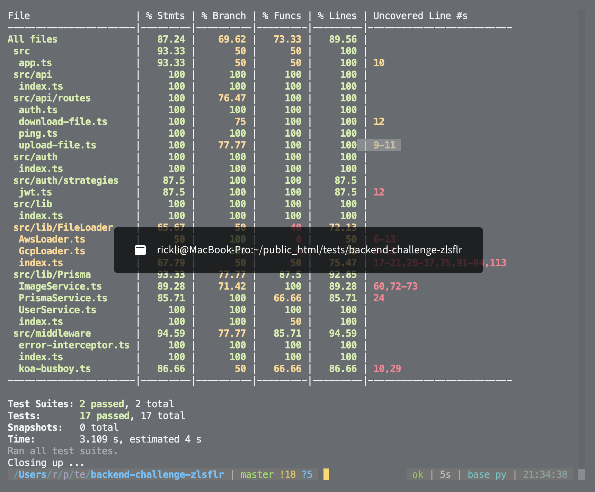

# Overview Project Architecture & Structure

The project is using Koajs, Prisma(ORM), Passportjs(Authentication) to build image upload/download functionality.

Folders

- test : includes test files
- prisma : migration scripts responsible for db setup & update
- src/api : all api routes
- src/assets : contains upload / download file placement
- src/auth : contains all auth strategies, for this project only jwt.ts
- src/lib/Fileloader : Responsible for handling file upload/download, using state pattern to deligate different loader implementation
- src/lib/Prisma : Prisma services which responsible for all db operations using singleton pattern
- src/middleware : All koa middleware, koa-busboy is the main one for handling file upload
- .env & .env.test : former is dev and latter is test env

### How to run

- Step 1: `npm i`
- Step 2: `npm run db:dev:up` -> spinning up local postgres server in docker
- Step 3: `prisma:dev:deploy` -> deploy migration scripts under migration folder which create tables in postgres db
- Step 4: `npm run start` -> start dev server running on localhost:3000

### Testing

- `npm run test` -> Integration test using pactumjs & supertest, spinning up new db in test env(you need to run `db:test:restart` to setup test db if you haven't done before) Or you can just run `npm run test:e2e` which takes care of everthing for you

- `npm run test:cov` -> Show test coverage

**`Note there are some lines not covered because they are fileloader that open for future integration with awsS3 or gcp storage purpose which not been implemented`**

### Authentication

- Using passport jwt to implement authentication for upload/download endpoint.
- User needs to signup first stored in database. Then signin to get access_token

### Database

- Postgres via docker compose
- Simple user table and image table which is one-to-many relationship. Image table stores the uploaded file path
- Password is hashed and stored. Signin will compare the hash match

### API endpoint

- POST /api/signup {email: string, password: string}
- POST /api/signin {email: string, password: string}
- POST /images/upload {file: File[], platform?: string}
- POST /images/download {url: string, filePath?: string, platform?: string}

All endpoint are protected and error resistent with proper handling and sent back to customer
Single point of error handling sits in middleware error-interceptor.ts
